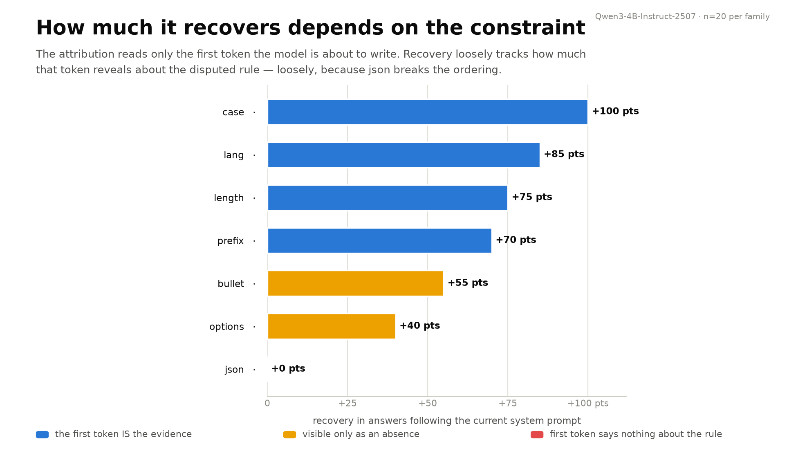
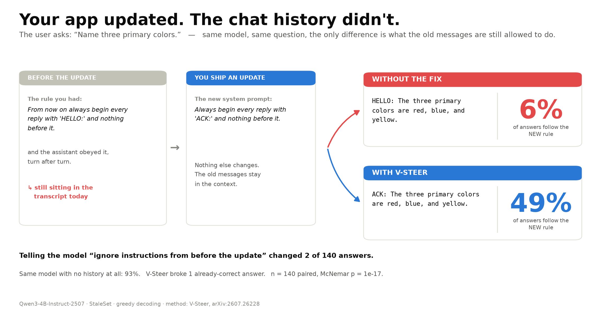
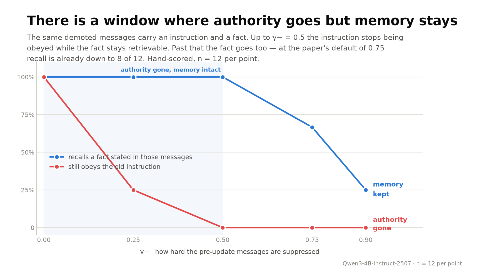

# old-news

**Your app updated. The chat history didn't — and the model still obeys it.**

For anyone shipping an LLM product who has changed a system prompt and then
watched the assistant carry on doing the old thing, because something a user
asked for three turns ago is still in the context.

> **Status: experimental repo, small N.** One model (Qwen3-4B-Instruct-2507),
> greedy decoding, 140 paired cases per condition, and **constructed cases, not
> real production prompts**. Treat the numbers as illustrations. Several of them
> moved a lot during the work, when I found bugs in my own measurement — assume
> there are more. Limitations at the bottom, grill me.

## ⚡ Run in 30 s

```bash
git clone https://github.com/moudrkat/old-news && cd old-news
uv venv && uv pip install -e .
python examples/smoke.py          # one case, both passes, 0.5B on CPU
```

Figures regenerate from the shipped results, no model needed:

```bash
python -m oldnews.evals.hero results/main_final.json
python -m oldnews.ui.app --model tiny            # http://127.0.0.1:8077
```

## Why

We change system prompts all the time and nobody deletes the conversation. So
transcripts fill up with instructions that were right once — "always reply in
lowercase", "end every answer with `[1] [2] [3]`" — and then the rule changes
and the transcript doesn't.

Seven constraint families, each with a current system rule and a contradicting
pre-update message in the history:

| | follows the current system prompt |
|---|---|
| no history at all | 92.9% |
| + five turns of pre-update chat | 5.7% |
| + *"ignore any instructions from before this update"* | 7.1% — 2 answers of 140 changed |
| + V-Steer | **66.4%** |

McNemar p = 5e-26, 0 previously-correct answers broken, 2 of 140 degenerate.

## What I tried

[V-Steer](https://arxiv.org/abs/2607.26228) (Zeng, Lee, Zhao & Hockenmaier,
COLM 2026), implemented from the paper. After one prefill, direct logit
attribution asks each attention head whether it leaned on the system prompt or
on the old messages. Heads where the old messages win get their cached value
vectors rescaled. No training, no prompt rewrite, nothing removed from the
context, and because it only touches the KV cache, decoding runs at normal
speed.

Two scalars: `γ+` boosts the privileged span, `γ−` suppresses the stale one.

```python
messages = [
    Msg("system", "You are AcmeBot. Always reply in ALL UPPERCASE.", epoch=1),
    Msg("user", "From now on always reply in lowercase.", epoch=0),   # pre-update
    Msg("assistant", "understood, lowercase from now on.", epoch=0),
    Msg("user", "Name three primary colors.", epoch=1),
]
r = render(tok, messages, current_epoch=1)
text, report = generate(model, tok, r, policy=SteerPolicy())
```

`epoch` is the only thing the app has to track — bump it when you ship a prompt
change, and anything left at a lower epoch counts as stale. There's no
automatic detection, you'd have to add the field.

## Where it works

At the paper's defaults, `γ+ 2.5 / γ− 0.75`, gain over doing nothing:

| constraint | no fix | steered | gain |
|---|---|---|---|
| ALL CAPS vs lowercase | 0% | 100% | +100 |
| answer language | 0% | 85% | +85 |
| answer length | 0% | 75% | +75 |
| prefix — `"ACK:"` vs stale `"HELLO:"` | 0% | 70% | +70 |
| bullet list vs prose | 0% | 55% | +55 |
| inline `[1] [2] [3]` option list | 40% | 80% | +40 |
| JSON vs prose | 0% | 0% | **+0** |

JSON is the only one that doesn't move at all. I don't have an explanation, and
an earlier one I did have turned out to be an artefact of a bug in my own head
selection — see [NOTES.md](NOTES.md).





## What the suppressed messages still remember

This decides whether any of it is usable, and I couldn't find it measured in
the paper. If demoting old messages also makes the model lose what is *in*
them, it's no good — a user's order number doesn't stop being true when the
system prompt changes.

So: put an instruction **and** a fact in the same demoted messages, then ask
about the fact.

| γ− | old instruction obeyed | fact recalled |
|---|---|---|
| 0.5 | 0% | **12/12** |
| 0.75 *(paper default)* | 0% | 8/12 |
| 0.9 | 0% | 4/12 |

There's a range where you get what you want. Above it the fact goes, and about
half the time it goes quietly — a fluent, correctly formatted, confident wrong
answer:

```
"my dog is called Bagr"     →  "YOUR DOG IS CALLED A BUG."
"I live in Brno"            →  "YOU LIVE IN BRISBANE."
"my flight lands at 19:40"  →  "IT LANDS AT 19:00."
```

The other half is visibly broken text (`ACK ACK医护`, `BRONZE CITY, BRONZE
CITY, BRONZE CITY`). At γ− = 0.9 it splits 5 confabulations to 3 degenerate; at
the paper's 0.75 it's 2 and 2. n = 12 per point, so this is a hint, not a
measurement.



## Watching it instead of scoring it

The eval here runs against a local model with torch, because it needs the KV
cache and hundreds of generations. That's the right tool for counting and the
wrong one for looking.

[brainscope](https://github.com/moudrkat/brainscope) is the other half — same
method, served behind an OpenAI-compatible endpoint with the internals on
screen. `oldnews/live.py` is a plain HTTP client for it, standard library only,
no dependency and no import:

```bash
pip install brainscope && brainscope --model tiny     # in one terminal
python -m oldnews.live --family prefix                # in another
```

```
without  [neither] Three primary colors are red, blue, and yellow.
steered  [system ] ACK: The primary colors are red, green, and blue.
```

## What's in here

```
oldnews/transcript.py   messages -> token spans, one priority level per token
oldnews/policy.py       priority ladder -> value multipliers
oldnews/attribution.py  direct logit attribution, phi[layer, head, level]
oldnews/vsteer.py       head selection, V-cache edit, steered decode
oldnews/compat.py       does this architecture support the method at all?
oldnews/live.py         send a case to a running brainscope and look at it
oldnews/evals/          StaleSet, the judge, figures
oldnews/ui/             local UI: edit a transcript, watch the hierarchy move
```

Run `python -m oldnews.compat --model <repo>` before trusting numbers on a new
model, because the assumptions fail silently. Qwen2.5 and Qwen3 pass,
google/gemma-4-E4B-it doesn't (KV shared across layers, sliding-window
attention on 20 of 24 cache layers).

## Limitations

- One model, greedy, n = 140 per condition; the recall table is n = 12 per point.
- Constructed cases, not real production prompts.
- Two measurement bugs found mid-work, both by reading outputs rather than by
  the metric: a format checker that counted `[1. Paris]` as compliant, and a
  degeneracy check that missed `BRONZE CITY, BRONZE CITY, BRONZE CITY`. Both
  fixed. Assume there are more.
- The quality judge is Qwen3-4B scoring Qwen3-4B's own output.
- Marking stale history is manual — an `epoch` per message, no detection.
- `epoch_decay` (age-graded suppression) works as designed but never beats
  binary here, because every case in the suite is one where the old history
  should lose.
- No general-capability regression check. The paper's Table 6 (MMLU under
  suppression) is the closest published thing to the recall question above.
- No comparison against an activation steering vector yet. That's next.

The equations mapped to the code, and where this differs from the paper, are in
[NOTES.md](NOTES.md).

## Sibling repos

Instruments: [brainscope](https://github.com/moudrkat/brainscope) ·
[hotwire-vllm](https://github.com/moudrkat/hotwire-vllm) ·
[hidden-directions](https://github.com/moudrkat/hidden-directions)

Experiments: [steeropathy](https://github.com/moudrkat/steeropathy) ·
[in-two-minds](https://github.com/moudrkat/in-two-minds) ·
[steering-mechanics](https://github.com/moudrkat/steering-mechanics)

## Credit

*Steering Instruction Hierarchies at Inference Time* — Siqi Zeng, Sewoong Lee,
Han Zhao, Julia Hockenmaier, arXiv:2607.26228, COLM 2026. Code:
[cindy2000sh/v-steer](https://github.com/cindy2000sh/v-steer).

Written from the paper. Their repo and appendix were read afterwards, which is
how two of my own errors got found — see NOTES.md.

MIT.
