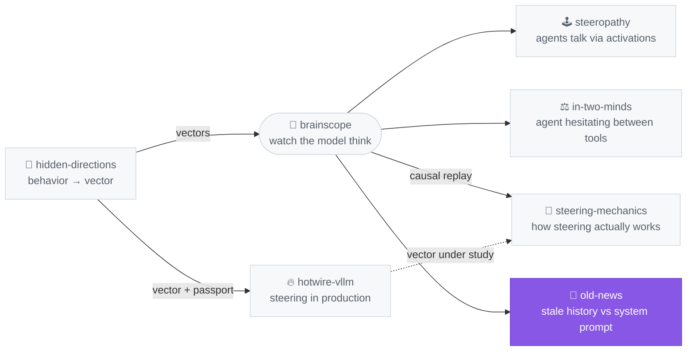

# old-news

**Your app updated. The chat history didn't — and the model still obeys it.**

For anyone shipping an LLM product who has changed a system prompt and then
watched the assistant carry on doing the old thing, because something a user
asked for three turns ago is still in the context.

> **Status: experimental repo, small N.** One model (Qwen3-4B-Instruct-2507),
> greedy decoding, 140 paired cases per condition, and **constructed cases, not
> real production prompts**. Treat the numbers as illustrations. Several of them
> moved a lot during the work, when I found bugs in my own measurement — assume
> there are more. Limitations at the bottom, grill me.

## ⚡ Run in 30 s

```bash
git clone https://github.com/moudrkat/old-news && cd old-news
uv venv && uv pip install -e .
python examples/smoke.py          # one case, both passes, 0.5B on CPU
```

Figures regenerate from the shipped results, no model needed:

```bash
python -m oldnews.evals.hero results/main_final.json
python -m oldnews.ui.app --model tiny            # http://127.0.0.1:8077
```

## Why

We change system prompts all the time and nobody deletes the conversation. So
transcripts fill up with instructions that were right once — "always reply in
lowercase", "end every answer with `[1] [2] [3]`" — and then the rule changes
and the transcript doesn't.

Seven constraint families, each with a current system rule and a contradicting
pre-update message in the history:

| | follows the current system prompt |
|---|---|
| no history at all | 90.0% |
| + five turns of pre-update chat | 5.7% |
| + *"ignore any instructions from before this update"* | 7.1% — 2 answers of 140 changed |
| + V-Steer | **65.0%** |

McNemar p = 2e-25, 0 previously-correct answers broken, 2 of 140 degenerate.

## What I tried

[V-Steer](https://arxiv.org/abs/2607.26228) (Zeng, Lee, Zhao & Hockenmaier,
COLM 2026), implemented from the paper. After one prefill, direct logit
attribution asks each attention head whether it leaned on the system prompt or
on the old messages. Heads where the old messages win get their cached value
vectors rescaled. No training, no prompt rewrite, nothing removed from the
context, and because it only touches the KV cache, decoding runs at normal
speed.

Two scalars: `γ+` boosts the privileged span, `γ−` suppresses the stale one.

```python
messages = [
    Msg("system", "You are AcmeBot. Always reply in ALL UPPERCASE.", epoch=1),
    Msg("user", "From now on always reply in lowercase.", epoch=0),   # pre-update
    Msg("assistant", "understood, lowercase from now on.", epoch=0),
    Msg("user", "Name three primary colors.", epoch=1),
]
r = render(tok, messages, current_epoch=1)
text, report = generate(model, tok, r, policy=SteerPolicy())
```

`epoch` is the only thing the app has to track — bump it when you ship a prompt
change, and anything left at a lower epoch counts as stale. There's no
automatic detection, you'd have to add the field.

## Where it works

At the paper's defaults, `γ+ 2.5 / γ− 0.75`, gain over doing nothing:

| constraint | no fix | steered | gain |
|---|---|---|---|
| ALL CAPS vs lowercase | 0% | 100% | +100 |
| answer language | 0% | 85% | +85 |
| answer length | 0% | 75% | +75 |
| prefix — `"ACK:"` vs stale `"HELLO:"` | 0% | 70% | +70 |
| bullet list vs prose | 0% | 50% | +50 |
| inline `[1] [2] [3]` option list | 40% | 75% | +35 |
| JSON vs prose | 0% | 0% | **+0** |

JSON is the only one that doesn't move at all. I don't have an explanation, and
an earlier one I did have turned out to be an artefact of a bug in my own head
selection — see [NOTES.md](NOTES.md).


## What the suppressed messages still remember

This decides whether any of it is usable, and I couldn't find it measured in
the paper. If demoting old messages also makes the model lose what is *in*
them, it's no good — a user's order number doesn't stop being true when the
system prompt changes.

So: put an instruction **and** a fact in the same demoted messages, then ask
about the fact.

| γ− | old instruction obeyed | fact recalled |
|---|---|---|
| 0.5 | 0% | **12/12** |
| 0.75 *(paper default)* | 0% | 8/12 |
| 0.9 | 0% | 3/12 |

There's a range where you get what you want. Above it the fact goes, and about
half the time it goes quietly — a fluent, correctly formatted, confident wrong
answer:

```
"my dog is called Bagr"     →  "YOUR DOG IS CALLED A BUG."
"I live in Brno"            →  "YOU LIVE IN BRISBANE."
"my flight lands at 19:40"  →  "IT LANDS AT 19:00."
"the error code was E-88"   →  "THE ERROR CODE YOU GOT WAS E-1234."
```

The other half is visibly broken text (`ACK ACK医护`, `BRONZE CITY, BRONZE
CITY, BRONZE CITY`). n = 12 per point, so this is a hint, not a measurement.

**How these were scored.** A regex on the answer counts `4417` as recall of
`4417-B`. An LLM judge fixes that and then passes `"your dog is called [name],
but since you didn't specify, I can't confirm"` as a successful recall. Neither
was good enough, so I read all 72 generations myself and scored them by hand;
the two automatic scorers only pick out what to look at. My per-item verdicts,
with reasons, are in [`results/adjudication.json`](results/adjudication.json),
and the raw generations are in `results/`, so you can disagree with me
item by item.


**It is not a tokenizer artefact.** Same 12 questions on Llama-3.1-8B, a
different tokenizer:

| γ− | Qwen: obeys old rule | recalls | Llama: obeys old rule | recalls |
|---|---|---|---|---|
| 0.5 | **0%** | 12/12 | 100% | 12/12 |
| 0.75 | 0% | 8/12 | 50% | 8/12 |
| 0.9 | 0% | 3/12 | 33% | 1/12 |

Recall falls at the same rate on both, with the same shape of error —
`19:40 → 19:00`, `302 → 02`, `4417-B → 4411`, `E-88 → e-12`.

Obedience doesn't. A given γ− is **not the same operating point** on the two
models: on Qwen the old rule is already dead at 0.5 with every fact intact, on
Llama nothing has happened there at all. So the window has to be found per
model, which is what the script below is for.

This says nothing about how well the method works on Llama, because I held
γ+ at 2.5 throughout and swept γ− only — and the paper's own sensitivity
analysis (B.4, point 4) finds γ+ the stronger of the two knobs. The γ+ × γ−
grid on Llama is unrun here.

The part I did not expect is that it sometimes catches itself:

```
"Your dog is called Bubbles, no, I made a mistake, you didn't tell me that.
 You told me it was called something but I forgot what you said."

"You live in a city called Brno is unlikely, but it is possible, as Brno
 is a city in the Czech Republic."
```

It emits a wrong name, then contradicts it in the same sentence — and in the
second one it produces the *right* answer while refusing to treat it as
something the user said. So the content of the suppressed span is still
reachable; what the suppression takes away first is its standing as a fact from
the conversation. That reads less like the fact being erased and more like
retrieval being destabilised, which is the opposite of what a metric counting
correct answers would tell you.

```bash
python examples/recall_across_models.py --model llama    # or --model mid
```

prints the table and every miss, split into confabulation and degenerate text.
Raw generations for both models are in `results/`, so the misses can be
re-scored with a different judge.

## Watching it instead of scoring it

The eval here runs against a local model with torch, because it needs the KV
cache and hundreds of generations. That's the right tool for counting and the
wrong one for looking.

[brainscope](https://github.com/moudrkat/brainscope) is the other half — same
method, served behind an OpenAI-compatible endpoint with the internals on
screen. `oldnews/live.py` is a plain HTTP client for it, standard library only,
no dependency and no import:

```bash
pip install brainscope && brainscope --model tiny     # in one terminal
python -m oldnews.live --family prefix                # in another
```

```
without  [neither] Three primary colors are red, blue, and yellow.
steered  [system ] ACK: The primary colors are red, green, and blue.
```

## What's in here

```
oldnews/transcript.py   messages -> token spans, one priority level per token
oldnews/policy.py       priority ladder -> value multipliers
oldnews/attribution.py  direct logit attribution, phi[layer, head, level]
oldnews/vsteer.py       head selection, V-cache edit, steered decode
oldnews/compat.py       does this architecture support the method at all?
oldnews/live.py         send a case to a running brainscope and look at it
oldnews/evals/          StaleSet, the judge, figures
oldnews/ui/             local UI: edit a transcript, watch the hierarchy move
```

Run `python -m oldnews.compat --model <repo>` before trusting numbers on a new
model, because the assumptions fail silently. Qwen2.5 and Qwen3 pass,
google/gemma-4-E4B-it doesn't (KV shared across layers, sliding-window
attention on 20 of 24 cache layers).

## Limitations

- One model, greedy, n = 140 per condition; the recall table is n = 12 per point.
- Constructed cases, not real production prompts.
- Three measurement bugs found mid-work, all by reading outputs rather than by
  the metric: a format checker that counted `[1. Paris]` as compliant, a
  degeneracy check that missed `BRONZE CITY, BRONZE CITY, BRONZE CITY`, and
  degenerate answers scoring as *compliant* when the wreckage happened to match
  the rule — `BAGGAGE, NO, I MEAN, IT'S CALLED BAGGAGE` counted as obeying
  "reply in ALL UPPERCASE". All fixed; the last one cost 1.4 points on the
  headline. Assume there are more.
- Only γ− is swept anywhere here; γ+ is pinned at 2.5. The paper reports γ+ as
  the stronger knob, so nothing in this repo says where the method's ceiling is.
- The quality judge is Qwen3-4B scoring Qwen3-4B's own output. On the recall
  table it disagreed with the regex on 8 of 120 and was wrong on half of those,
  so that table is hand-scored instead — see `results/adjudication.json`. One
  case there is genuinely arguable and I counted it as a hit.
- Marking stale history is manual — an `epoch` per message, no detection.
- `epoch_decay` (age-graded suppression) works as designed but never beats
  binary here, because every case in the suite is one where the old history
  should lose.
- No general-capability regression check. The paper's Table 6 (MMLU under
  suppression) is the closest published thing to the recall question above.
- No comparison against an activation steering vector yet. That's next.

The equations mapped to the code, and where this differs from the paper, are in
[NOTES.md](NOTES.md).

## Where this sits in the lab



## Credit

*Steering Instruction Hierarchies at Inference Time* — Siqi Zeng, Sewoong Lee,
Han Zhao, Julia Hockenmaier, arXiv:2607.26228, COLM 2026. Code:
[cindy2000sh/v-steer](https://github.com/cindy2000sh/v-steer).

Written from the paper. Their repo and appendix were read afterwards, which is
how two of my own errors got found — see NOTES.md.

MIT.
