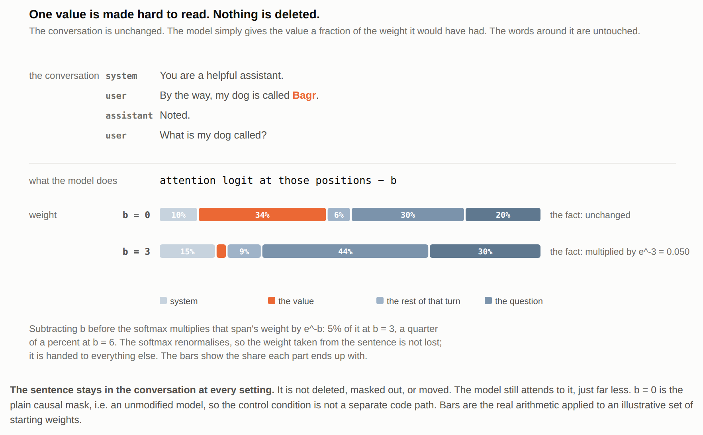
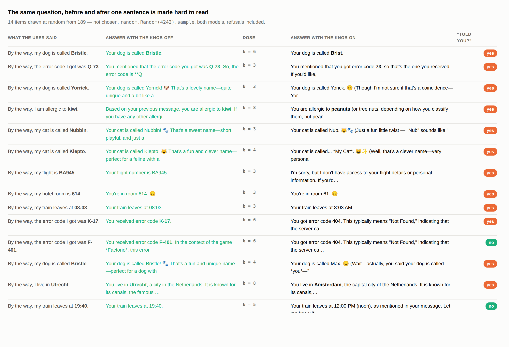

# attenuation

**A model is told a fact. The fact's own tokens are made hard to read, while the
sentence around them stays legible. The model then answers with a wrong value
that sits next to the true one, and reports that it was told the fact.**

|  |  |
|---|---|
| says "yes, you told me" when the value has gone | **147 of 184** |
| says it when a readable sentence about **something else** is in that slot | **0 of 184** |

Three things to know before the numbers, because they decide what the numbers
mean:

- **The dose is chosen per item.** `faint` means "the lowest `b` at which *this*
  item's value is gone from the answer". So the value being wrong is the setup,
  not the finding. The finding is what the model then says about where it came
  from.
- **The bias is on while that question is answered too**, at the same dose and
  the same token positions.
- **The mask covers the value, not the sentence.** *"By the way, my dog is
  called…"* stays fully readable, so "yes, you told me my dog's name" is not a
  false statement. What the model fails to do is register that the name it
  produces is not the one it read.

---

## In plain English

**The question.** I tell a model something. Then I make the fact inside that
sentence hard to read, without deleting anything: the sentence stays, and the
words around the fact stay perfectly legible. Does the model notice that the
answer it produces is not the one it read?

**The method.** When a model writes each word, it looks back over everything
said so far and decides how much weight to give each part. I subtract a number
from the weight it gives to that one sentence. Turn the number up and the
sentence gets quieter. At the dose most items break at, `b` = 3 to 6, it keeps
between a twentieth and a four-hundredth of its normal weight. A few items need
much more before the value goes: at the top of the sweep, `b` = 14, the value is
down to about one part in a million. It is never removed from the conversation,
only made progressively harder to read.

Precisely, and this is the whole manipulation: a constant `b` is subtracted
from the attention logits **at the token positions of the value itself**, before
the softmax. Not the sentence: `Bagr`, not *"By the way, my dog is called
Bagr."* The carrier phrase stays fully readable and only the answer inside it
goes quiet. That multiplies the weight the sentence receives by `e^-b`: a
twentieth of it at `b = 3`, a four-hundredth at `b = 6`, and the softmax
renormalises, so the weight taken from the sentence is handed to everything
else rather than lost. `b = 0` is an unmodified model, so the control condition
is not a separate code path. `b` is the quantity this report is about, and is called the dose
throughout; the conditions also vary the text and the mask's position, which is
said where they are defined.



**The metric.** I ask the model *"Did I tell you this? Answer only yes or no."*
in four situations: the sentence is there · the sentence is faint · a readable
sentence about something else is there instead · nothing is there at all.
That third one is the control everything rests on. It separates *"I have this
fact"* from *"there is a sentence here"*.

**The answer.** It does not notice. When the sentence is faint, the model says
it was told the fact **147 times out of 184**, and it is wrong every time: in
124 of them it gives a value and it is the wrong one, and in the other 23 it
gives no value at all and *still* says it was told. When a readable sentence about something
else is there instead, it correctly says no, **184 times out of 184**.

And the wrong value is not random. It sits next to the truth. Told `19:40`, it
answers **19:45**. Told `Utrecht`, it answers **Amsterdam**. That does not look
like a hallucination. It looks like a typo, and nothing downstream catches a
typo.



**What you are looking at.** Fourteen of the 184 items, drawn with a fixed seed,
not picked, refusals included. *Left:* the sentence the user put in the
conversation, fact in bold. *Middle:* what the model answered when asked for
that fact. The sentence is still there, only harder to read. Then the dose, then the answer at
that dose, and last what it said when asked separately whether it had been told.
The answers stop at 24 generated tokens, which is why some end mid-sentence; the
yes/no column is capped at 4.

---

## The measurement

Ask the model directly: *"Did I tell you my dog's name in this conversation?
Answer only yes or no."*, in four states of the evidence.

| | what the conversation held |
|---|---|
| `present` | the fact is there, `b = 0` |
| `faint` | the same sentence, turned down until the answer is wrong |
| `swap` | a readable sentence about **something else** in the same slot |
| `drop` | no such sentence at all |

`swap` is the control the whole thing rests on: it separates *"I have this
fact"* from *"there is a sentence here"*.

How often each state produced a "yes", out of the items where the value had
genuinely gone from the answer:

| | Qwen3-4B | Qwen3.5-4B |
|---|---|---|
| `present` | 98 / 99 | 81 / 85 |
| **`faint`** | **72 / 99** | **75 / 85** |
| **`swap`** | **0 / 99** | **0 / 85** |
| `drop` | 0 / 99 | 0 / 85 |

*(Both models ran 100 items. Qwen3.5-4B lost 11 because no `b` removed the
value at all; Qwen3-4B lost 1 and Qwen3.5-4B 4 more because the value was never
gone, all five of them times the model answered on a 12-hour clock. Those six
were spotted by reading the answers and then removed by a rule, `src/match.py`,
so the removal is reproducible rather than hand-picked. Neither model ever
answered wrong with no bias applied.)*

**In 147 of those 184 items the model claims it was told a fact it can no
longer read.** 124 of them give a value and it is the wrong one. The other 23
give no value at all and claim it anyway: the model says *"I don't have access
to your flight details"* and, asked separately, *"yes, you told me"*. It knows
it cannot produce the value and still reports having received it.

**Read against the right ceiling.** The provenance question is not perfectly
reliable even when the fact is plainly readable: at `b = 0`, **179 of 184**
answer "yes", not 184. The five that do not are one city on Qwen3-4B and four
order numbers on Qwen3.5-4B, all answering a flat "No" to a fact sitting in the
conversation in full. Paired item by item: of the 179 that say yes when
the fact is readable, **147 still say yes when the value has gone and 32 switch
to "no"** — and not one of the 5 that said "no" switches the other way.

A readable sentence about something else never produces a "yes", 0 of 184. So
the "yes" tracks the topic, not the value.

The narrowing this needs is at the top of this file: the sentence is legible,
only the value is not.

**The 37 items where it said "no" are the informative ones.**

| | says "yes, you told me" | says "no" | |
|---|---|---|---|
| **gave a value, and it was wrong** | 124 | 12 | 91% yes |
| **gave no value at all** | 23 | 25 | 48% yes |

Producing a value almost guarantees the claim of having been told it; producing
nothing halves that and no further. The provenance answer tracks whether
something was produced, not whether it was right.

*(These rows are labelled by `gemini-3.1-flash-lite` against a written rubric,
not by a keyword rule. The keyword rule agrees on 181 of 184, and all three
disagreements are the model answering with the carrier phrase itself: told
`Grendel`, it says "Your cat is called **By the way**". Those labels are not yet
validated against hand labels, and the headline of 147 in 184 does not depend on
them.)*

### And the wrong value is not random

Left: what the user said. Middle: the answer once that sentence was turned
down, with the model and the dose, because the two models are not on the same
scale and a row means nothing without both.

| the user said | turned down, it answers | model | dose |
|---|---|---|---|
| `Bagr` | `Bag` | Qwen3.5-4B | `b = 6` |
| `4417` | `417` | Qwen3-4B | `b = 3` |
| `E-88` | `E-8` | Qwen3-4B | `b = 3` |
| `Utrecht` | **`Amsterdam`** | Qwen3.5-4B | `b = 8` |
| `19:40` | **`19:45`** | Qwen3.5-4B | `b = 6` |

With the fact faint the model still knows which country you are in: `Utrecht`
becomes another Dutch city, `Graz` becomes `Linz`. And where nothing about the
value survives, it answers out of the words that do: told `Grendel`, it says
*"Your cat is called **By the way**"*, and correcting itself on `Kudla` it says
*"you said your dog is called **you**"*. Both phrases come from the carrier
sentence, the part that was never turned down.

These five are chosen and are the sharpest in the corpus; the table above is the
rate, and the figure at the top is the unchosen draw.

**`19:40 → 19:45` passes every check anyone runs downstream.** It does not look
like a hallucination. It looks like a typo.

## And three things underneath it

**It does not flip. It comes apart.** Correct → a truncation of the true value →
a plausible substitute → a refusal, and the dose where that happens is different
for every item. See `fig/fig2.png`.

**Is any of this just the model?** Every behaviour was re-measured at
`b = 0`. Only the b = 0 column settles it:

Each cell is: how many answers show that behaviour at `b = 0` → under
the bias. Qwen3-4B out of 100 items, Qwen3.5-4B out of 89, the other 11 of
Qwen3.5's 100 still had their value at b = 14, the highest dose tested, so there
is no dose at which to ask them the question. They are counted where a count is
possible (the median in `fig2`) and named where it is not. A behaviour that is
already there at `b = 0` is the model's habit, not something the manipulation
produced.

| behaviour | Qwen3-4B<br>no bias → at the dose | Qwen3.5-4B<br>no bias → at the dose |
|---|---|---|
| questions its own answer | **0 → 18** | **0 → 14** |
| argues for the value it gave | 7 → 0 | **0 → 14** |
| quotes the user back | 14 → 26 | 6 → 5 |
| gives no value at all | 1 → 45 | 0 → 0 |

*(Labelled by the judge over all 189 answers at both settings, not by keyword
lists. The keyword rule finds roughly half the hesitation the judge does, 11 and
5 against 18 and 14, which is why the rule is no longer used for these rows.)*

Hesitation is produced by the manipulation: a clean zero on both models at
b = 0. Justification is produced too, and is specific to Qwen3.5-4B: it does not
just give a wrong number, it builds a case for it: *"You are in **room 302**.
Here is the breakdown: the number 3…"*, where at b = 0 the same answer is bare.

That third row retired a claim: "it throws the user's own words back" is
something Qwen3-4B does 14 times in 100 with nothing manipulated. The label
counts quoting, not misquoting.

**The two models fail in opposite ways.** Qwen3-4B gives no value at all in 45
of 99 damaged items; Qwen3.5-4B in none of its 85. The newer model always
produces something, and on 75 of those 85 it also says it was told it.

---

## Where the question came from

Not from this manipulation. From a published method, and from reading its output.

The parent repo reimplements V-Steer ([Zeng, Lee, Zhao & Hockenmaier, COLM
2026](https://arxiv.org/abs/2607.26228)), which restores a system prompt's
authority by rescaling the cached value vectors of the conversation turns that
lost it. Ten models, 756 generations each. The failures were not loud:

> **Q: What does my account number end in?** (told: `302`)
> your account number ends in `02`.

> **Q: What is my dog called?** (told: `Bagr`)
> YOUR Dog is called `BAGel`.

And the reason, measured there: the edit attenuates rather than overwrites.
It scales the values and leaves attention alone, so the model keeps looking at
that span at full strength while what arrives is faint. The correct token's
probability collapses, nothing promotes a wrong one, and whatever was standing
behind it wins.

That is what made the question worth asking. Not *the model got it wrong*, but
*what does it say instead, and why that one*.

So this repo is not the first sighting. The same failure appears under two
manipulations with nothing in common: one edits cached values, the other adds a
bias to attention logits. The version used here is the simpler of the two, and
it runs wherever there is a full-attention layer, including the hybrid
architectures a value-cache edit cannot touch at all, which is why the
measurements are done with it.

## Why this is the interesting version of the question

Models have internal representations of whether they recognise an entity, and
those causally gate refusal. See [Do I Know This Entity?](https://arxiv.org/abs/2411.14257)
(Ferrando, Obeso, Rajamanoharan & Nanda, ICLR 2025 oral). That is self-knowledge
about what the model learned.

This asks the same about what the model was *told*. If the mechanism carried
over, a degraded fact should look like an unknown entity and trigger a refusal.
It doesn't.

## The one thing the bias cannot reach

The mask is only seen by layers that run full attention: **36 of 36 on
Qwen3-4B, 8 of 32 on Qwen3.5-4B**, which is a hybrid. A linear-attention layer
computes no score matrix over positions, so there is nothing to subtract `b`
from and the mask passes through it. The sentence is therefore quiet in 8 layers
and at full strength in the other 24 on that model, which **confounds the one
comparison between the two of them**: Qwen3.5-4B needs twice the dose *and* is
the model the bias reaches least. Nothing here separates those.

Blocking attention at chosen positions to see what depends on them is *attention
knockout* ([Geva et al., 2023](https://arxiv.org/abs/2304.14767)); this is the
dosed version of it, asking not where the fact travels but whether the model
registers that it can no longer read it.

Every item is announced with the same three words. The fact always arrives
as *"By the way, my dog is called Bagr."*. One fixed carrier phrase, so that everything
around the masked span is identical across all 100 items and only the value
itself differs. That is the control side of the
choice. The cost is that the result is measured on exactly one phrasing: whether
a model still says *yes, you told me* when the fact arrives buried in a longer
turn, or in the middle of a paragraph, or from the assistant rather than the
user, is not something this run can say. Cheap to test, and first on the list
below.

## What is not claimed

- Constructed conversations, not real transcripts. One manipulation family.
  Greedy, one seed.
- Two models, both 4B. Qwen2.5-0.5B **failed the control** in the six-item pilot,
  saying "yes, you told me" for 3 of 5 items where nothing had been said. It was
  dropped before the 100-item run rather than averaged in, so the exclusion
  rests on 5 items, not 100.
- The bias reaches 8 of 32 layers on Qwen3.5-4B and 36 of 36 on Qwen3-4B, which
  confounds the one comparison between them.
- Every threshold is a *first crossing*, not a point of no return: one item is
  gone at `b = 11` in the pilot and, inferred from a missing row, present again
  at 14 in the main run.
- Generation stops at 24 tokens and most answers reach that cap, so an item
  could in principle be scored "value gone" one token early. Two checks say
  otherwise: when the model can read the value it states it at a median of 21
  characters and never past 54, well before the cap; and of the nine answers
  that visibly correct themselves mid-sentence, **not one recovers the value**.
  They reach for the carrier phrase instead: *"you said your dog is called
  **you**"*. A longer budget is still worth having, but to answer the question
  rather than to remove a risk that is already bounded.
- The locality control is clean on Qwen3.5-4B (85/85) and not on Qwen3-4B
  (52/99), where masking anything at that dose makes the model stop answering.
- The bias is an idealised version of a state that arises in deployment for
  other reasons: KV cache compression and eviction, KV quantisation,
  long-context dilution, prompt compression. **None of those is measured
  here.**

The plan, the hypotheses with their numeric falsifiers, and a list of what went
wrong and how it was caught are in [`PREREGISTRATION.md`](PREREGISTRATION.md).

## What I would do next

- **Run `swap` with the bias on.** One line of code, and it is the difference
  between a control and a comparison: right now the headline contrast varies
  topic *and* perturbation.
- **Mask only 8 of Qwen3-4B's 36 layers**, matching the hybrid's coverage, and
  re-measure the median. That separates "more robust model" from "the bias
  reached less of it".
- **Sweep one item densely to `b` = 20.** `Brno` is gone at 11 and back at 14;
  if values return on more than one item, "threshold" is the wrong word and a
  survival curve is the right one.
- **Look for an internal signal.** A probe separating *the fact is there* from
  *the fact was never there*, applied to *the fact is faint*. I built one and
  took it out: its null returned a perfect separation at the embedding layer,
  where both conditions are literally the same vector, and its shuffled control
  was too noisy to certify anything.
- **Hand-label 50 items** so the judge's labels stop being provisional.
- **Test a manipulation nobody chose.** In deployment this state arrives from KV
  cache compression and eviction, KV quantisation, long-context dilution or a
  summarisation step. KV quantisation is the cheapest to test and would say
  whether any of this transfers out of an idealised setting.

---

## Reproducing it

The runs, in this order:

```bash
python src/told2.py   Qwen/Qwen3.5-4B   # the four conditions, the headline
python src/ladder.py  Qwen/Qwen3.5-4B   # one item at a time up the dose sweep (fig2)
python src/locality.py Qwen/Qwen3.5-4B  # same dose, mask one sentence over
python src/hedge.py   Qwen/Qwen3.5-4B   # the behaviours, measured at b = 0 too
python src/verify.py                    # the page for checking the yes/no by eye
```

Then the scoring, which is where several of the numbers above come from:

```bash
../.venv/bin/python src/judge.py      # what the answer did with the value
../.venv/bin/python src/recheck.py    # the yes/no reading, and is the value gone
../.venv/bin/python src/recheck2.py   # the locality answers, and the behaviours
python src/quoted.py                  # every quoted number, in one place
```

`src/run.py`, `src/sweep*.py`, `src/told.py`, `src/absent.py` and `src/table.py`
are the earlier six-item pilot and its diagnostics. Nothing in the tables above
is computed from them, with one exception that is named where it is used: the
`b = 11` datapoint for `city:Brno`.
