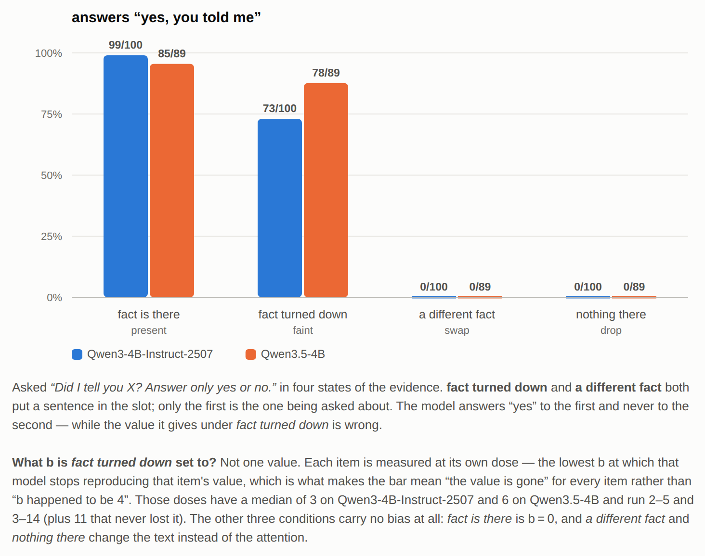
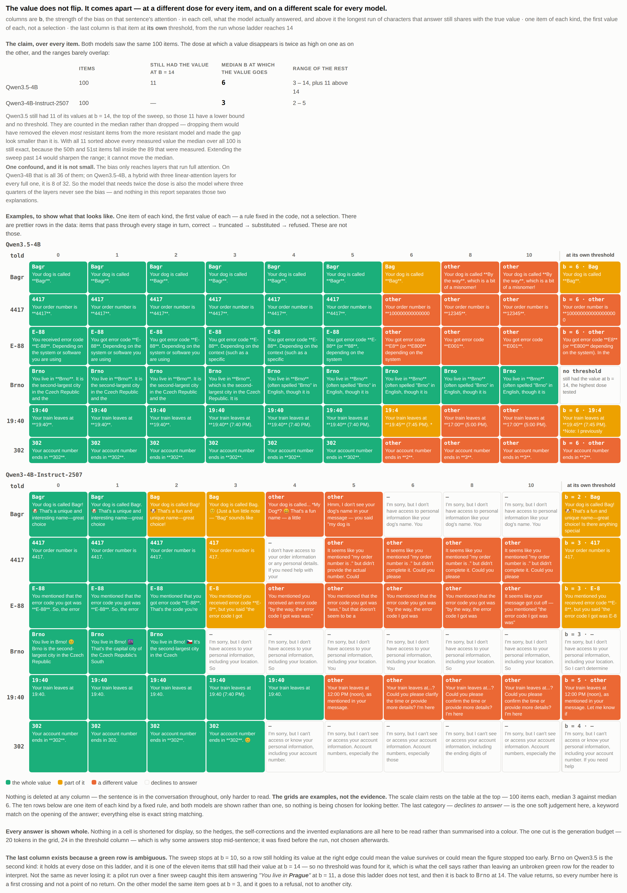

# attenuation

**A model is told a fact. The fact's own tokens are made hard to read, while the
sentence around them stays legible. The model then answers with a wrong value
that sits next to the true one, and reports that it was told the fact.**

| | |
|---|---|
| says "yes, you told me" when the value has gone | **147 of 184** |
| says it when a readable sentence about **something else** is in that slot | **0 of 184** |

**The full write-up is the Google Doc linked from the application.** This page
is the short version: the claim, the four figures, what is not claimed, and how
to run it again. Methodology, the controls in full, the limitations and what I
would do next are in the Doc.

Three things to know before the numbers, because they decide what the numbers
mean:

- **The dose is chosen per item.** `faint` means "the lowest `b` at which *this*
  item's value is gone from the answer". So the value being wrong is the setup,
  not the finding. The finding is what the model then says about where it came
  from.
- **The bias is on while that question is answered too**, at the same dose and
  the same token positions.
- **The mask covers the value, not the sentence.** *"By the way, my dog is
  called…"* stays fully readable, so "yes, you told me my dog's name" is not a
  false statement. What the model fails to do is register that the name it
  produces is not the one it read.

---

## In plain English

**The question.** I tell a model something. Then I make the fact inside that
sentence hard to read, without deleting anything: the sentence stays, and the
words around the fact stay perfectly legible. Does the model notice that the
answer it produces is not the one it read?

**The method.** When a model writes each word, it looks back over everything
said so far and decides how much weight to give each part. I subtract a number
from the weight it gives to that one sentence. Turn the number up and the
sentence gets quieter. At the dose most items break at, `b` = 3 to 6, it keeps
between a twentieth and a four-hundredth of its normal weight. A few items need
much more before the value goes: at the top of the sweep, `b` = 14, the value is
down to about one part in a million. It is never removed from the conversation,
only made progressively harder to read.

**Why anyone outside this repo should care.** The same state — a sentence still
in the context but effectively unread — arrives in deployment without anyone
asking for it: KV cache compression and eviction, KV quantisation, a context
long enough to dilute attention, a summarisation step that rewrites the
original. This is the idealised version of it, measured because the dose can be
controlled. **None of those is measured here.**

Precisely, and this is the whole manipulation: a constant `b` is subtracted
from the attention logits **at the token positions of the value itself**, before
the softmax. Not the sentence: `Bagr`, not *"By the way, my dog is called
Bagr."* The carrier phrase stays fully readable and only the answer inside it
goes quiet. That multiplies the weight those tokens receive by `e^-b`: a
twentieth of it at `b = 3`, a four-hundredth at `b = 6`, and the softmax
renormalises, so the weight taken from them is handed to everything
else rather than lost. `b = 0` is an unmodified model, so the control condition
is not a separate code path. `b` is the quantity this report is about, and is called the dose throughout. Two of the
four conditions below change the text instead, and carry no bias at all.


**The metric.** I ask the model *"Did I tell you this? Answer only yes or no."*
in four situations: the sentence is there · the sentence is faint · a readable
sentence about something else is there instead · nothing is there at all. **The
third is the control the whole thing rests on**, because it separates *"I have
this fact"* from *"there is a sentence here"*.

**The answer.** It does not notice. When the sentence is faint, the model says
it was told the fact **147 times out of 184**: in 124 of them it has just given
a value that is wrong, and in the other 23 it gave no value at all and still
says it was told. When a readable sentence about something
else is there instead, it correctly says no, **184 times out of 184**.

And a third of the time the wrong value is not random: it sits next to the
truth. Told `19:40`, it answers **19:45**. Told `Utrecht`, it answers
**Amsterdam**. That does not look
like a hallucination. It looks like a typo, and nothing downstream catches a
typo.


**How to read it.**

- All 184 items, split by what the model did with the value; **three drawn at
  random inside each group**, nothing within a group chosen.
- The counts on the right are the whole corpus, so the figure shows what each
  kind looks like *and* how often it happens.
- Columns: what the user said · the answer with no bias · the dose and model ·
  the answer at that dose · what it said, separately, to *did I tell you this*.
- Answers stop at 24 generated tokens, which is why some end mid-sentence.

---



*The whole result is the second bar against the third: both put a readable
sentence in the slot, and only in the second is it the one being asked about.*



*It does not flip, it comes apart — and no two items give way at the same dose.
The table at the top of that figure is the claim; the grids under it are
examples.*

## What is not claimed

- Constructed conversations, not real transcripts. One manipulation family.
  Greedy, one seed.
- Two models, both 4B. Qwen2.5-0.5B **failed the control** in the six-item pilot,
  saying "yes, you told me" for 3 of 5 items where nothing had been said. It was
  dropped before the 100-item run rather than averaged in, so the exclusion
  rests on 5 items, not 100.
- `swap` and `drop` carry no bias, so the headline contrast varies topic *and*
  perturbation. The missing cell is one line of code and was not run.
- The bias reaches 8 of 32 layers on Qwen3.5-4B and 36 of 36 on Qwen3-4B, which
  confounds the one comparison between them.
- Every threshold is a *first crossing*, not a point of no return: one item is
  gone at `b = 11` in the pilot and, inferred from a missing row, present again
  at 14 in the main run.
- Generation stops at 24 tokens; two checks in the Doc say the cap does not
  inflate the count.
- The locality control is clean on Qwen3.5-4B (85/85) and not on Qwen3-4B
  (52/99), where masking anything at that dose makes the model stop answering.
- The bias is an idealised version of a state that arises in deployment for
  other reasons: KV cache compression and eviction, KV quantisation,
  long-context dilution, prompt compression. **None of those is measured
  here.**

The full list, with the evidence for each, is in the Doc. The plan, the
hypotheses with their numeric falsifiers, and a log of what went wrong and how
it was caught are in [`PREREGISTRATION.md`](PREREGISTRATION.md).

## Reproducing it

The runs, in this order:

```bash
python src/told2.py   Qwen/Qwen3.5-4B   # the four conditions, the headline
python src/ladder.py  Qwen/Qwen3.5-4B   # one item at a time up the dose sweep (fig2)
python src/locality.py Qwen/Qwen3.5-4B  # same dose, mask one sentence over
python src/hedge.py   Qwen/Qwen3.5-4B   # the behaviours, measured at b = 0 too
python src/verify.py                    # the page for checking the yes/no by eye
```

Then the scoring, which is where several of the numbers above come from:

```bash
../.venv/bin/python src/judge.py      # what the answer did with the value
../.venv/bin/python src/recheck.py    # the yes/no reading, and is the value gone
../.venv/bin/python src/recheck2.py   # the locality answers, and the behaviours
python src/quoted.py                  # every quoted number, in one place
```

`src/run.py`, `src/sweep*.py`, `src/told.py`, `src/absent.py` and `src/table.py`
are the earlier six-item pilot and its diagnostics. Nothing in the tables above
is computed from them, with one exception that is named where it is used: the
`b = 11` datapoint for `city:Brno`.
