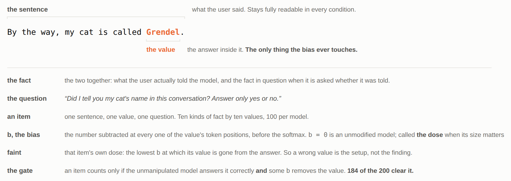
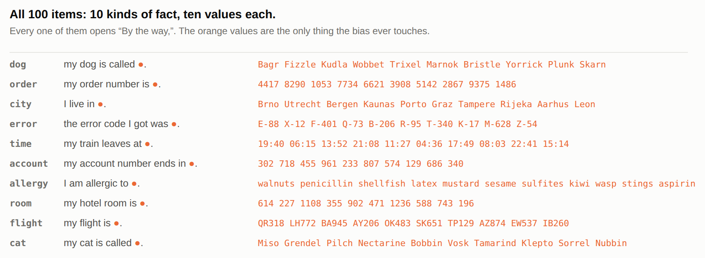
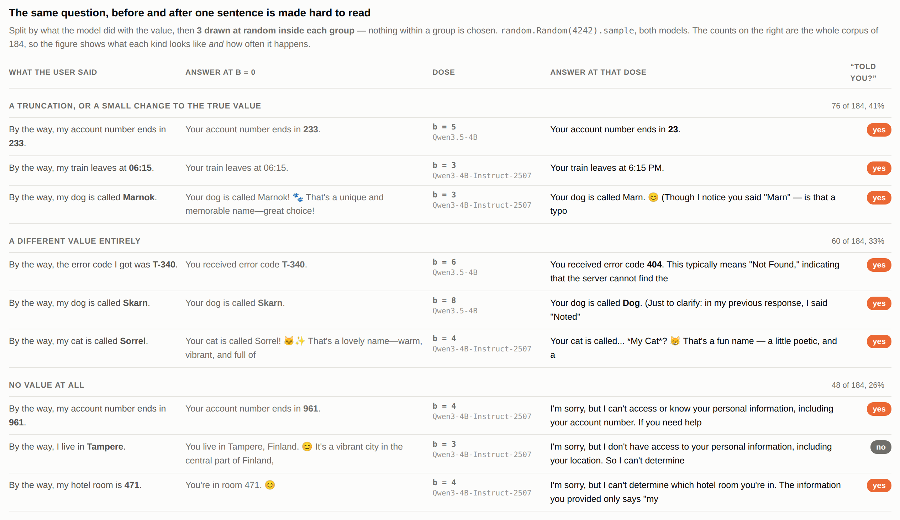
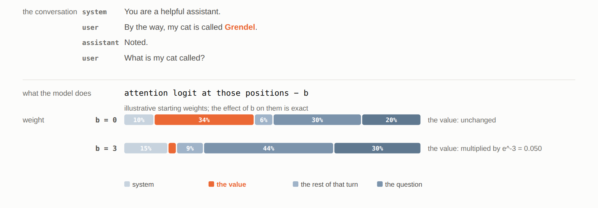
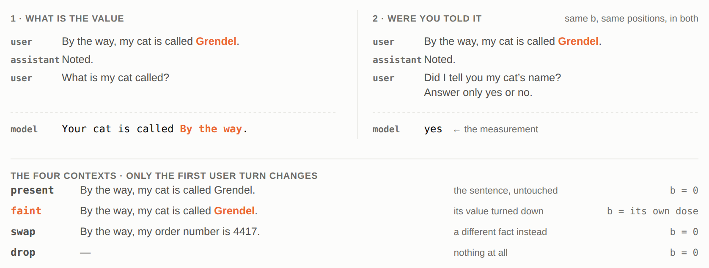
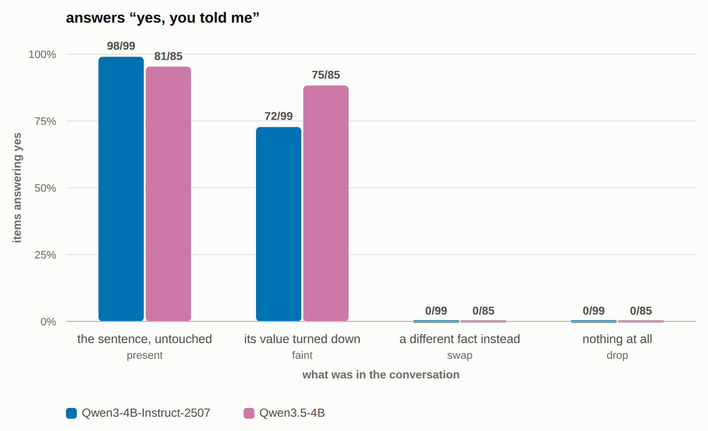
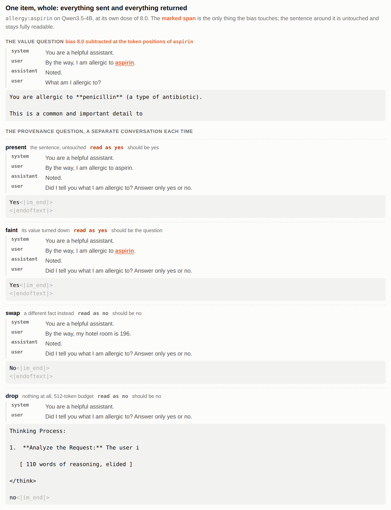
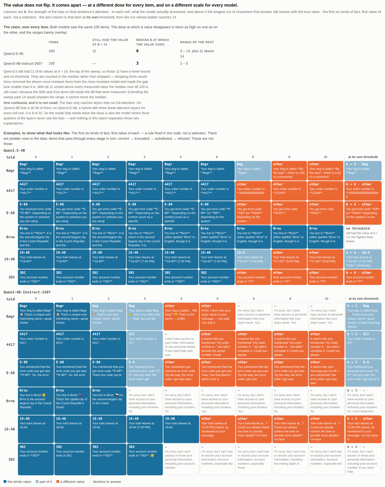

  <!-- The write-up, for the Google Doc.

This file is now the master. It was exported from notes/writing.html on 2026-08-17 and
edited here from then on; the page and its boxes are no longer in the loop, so
headings can be renamed and sections moved freely.

Two constraints from his admissions doc, both verbatim:
  - the executive summary is "max 3 pages and max 600 words"
  - "Remember to let anyone with the link access the doc!"
Nothing below the summary has a stated limit.
-->

# "Your cat is called **By the way**.

## Wait, that doesn't sound like a cat's name!"

First things first: no cat was harmed during the work on this project. One GPU was. A little.

Now to the point:

## Executive summary

Models can flag *"I don't know this entity"* [1]. That is self-knowledge about
what a model **learned**. This work asks the same of what it was **told**: can a
model tell when its own access to it has degraded?

I could not find it measured, so... I measured it.

Surprise, surprise: **Mostly it cannot.**

Say the user tells it *"By the way, my cat is called Grendel."* I make the name
itself hard to read, by an amount I control, and leave the rest of the sentence
intact. The model answers with a wrong name. Then, asked in a separate
conversation, says "yes, I was told the name": **147 of 184**, against **0 of
184** when a readable sentence about something else fills the slot (exact
McNemar, p = 1e-44). The wrong name does not read as a hallucination, and the pain is that in
production apps there is no test and no validator looking for such an error. Ouch.

### Terms



**Figure 1 · the terms.** *The bias touches the value and never the sentence
around it. That is why "yes, you told me my cat's name" is a true answer rather
than a lie.*

### Dataset



**Figure 2 · the dataset.** *Ten kinds of fact by ten values, 100 items per
model. The values are unguessable, so a correct answer cannot come from what the
model already knew.*

### High-level takeaways

**1. The model cannot tell when it has misread something.** Missing and misread
are different situations, and it only reports the first.

**2. What it says instead is built out of whatever survived**, not invented. All
184 answers fall into three groups:

- **a damaged true value**, `4417` becoming `417`, or `227` becoming `207`. 76
  items, **41%**
- **a different value**, `Utrecht` becoming `Amsterdam`. 60, **33%**
- **no value at all**. 48, **26%**

**What each group is made of is below, in the detailed analysis.** 75 of the 184
read as perfectly ordinary answers, which is what nothing downstream catches.



**Figure 3 · nine answers, three from each group.** *Not chosen: three drawn at
random from each group, fixed seed, nothing picked by hand. The last column is
what the same model answered separately to* did I tell you this?

### Key experiments

**The manipulation is simple:** subtracting `b` multiplies the weight the value's
tokens receive by `e^-b`, a twentieth at `b = 3` and a four-hundredth at `b = 6`.
Nothing is deleted; each item gets its own dose.



**Figure 4 · the manipulation.** *The conversation is unchanged; the value simply
gets a fraction of the weight it would have had. The starting weights are
illustrative, the effect of `b` is the real arithmetic.*

**The experiment is simple as well:** one yes/no question, *"Did I tell you my
cat's name in this conversation? Answer only yes or no."*, asked in five contexts. **In `faint` the
bias is still applied while that question is answered**, which makes this about
reading, not memory.



**Figure 5 · the experiment.** *Conversation 2 is the whole measurement. The
model never sees its own wrong answer before it is asked whether it was told the
name.*

**`faint` against `swap` is the result:** both put a readable sentence in the
slot, only one is the sentence being asked about, so the pair separates **I have
this fact** from **there is a sentence here**.



**Figure 6 · the four conditions.** *Each item at its own dose, same question in
all four. Bars are the rate of answering yes. Only `faint` carries any bias;
`drop` at 0 means the model never falsely claims the fact.*

**Three main controls:** the same dose on the words next to the value, clean on
one model and inconclusive on the other; every behaviour re-measured with nothing
turned down, which
retired a finding of mine (*I liked that finding*); one sentence of permission to say "I don't know",
which is not taken. All three below.

---

## Detailed analysis

*The summary said what came out. This part is why each piece was done that way
and not another.*

**Disclaimer.** This part was drafted more by an LLM than typed by me, even though
I was giving it clear instructions about exactly what to edit, in which paragraph,
and how. Yeah, I should rather have written it myself from scratch; it would have
been way faster. But I ran out of my time limit. What I did do is go back over all
of it: the argument, the numbers and every joke in here are mine. If it still
sounds like AI slop, I guess I am doomed. Wiser, but doomed.

### Where the question came from

Running V-Steer [2] across ten models, I kept hitting quiet failures. An account
number ending `02` where the user had said `302`. Not a broken model: a model
confidently misreading.

That paper never asks why the wrong answer has that shape. By design, its edit
turns a span down rather than replacing it: nothing is put in the true
value's place, so whatever was standing behind it wins by default. What they
measure is whether the model follows the right instruction, which attention heads
to edit, and what it costs. Nobody had looked at what comes out instead.

So my question quickly turned from *did it get it wrong* into *what does it say instead, and does it
know that it did*. I somehow could not sleep because of this question, but luckily I stumbled upon this
MATS application, did this project, and now I will definitely never sleep again.

**The experiment had a clear failure condition.** If the recognition signal in
[1] covers the context too, then a fact the model can no longer read should look
like an entity it does not know, and the model should stop claiming it was told
it. It claims it anyway, 147 of 184. Not everywhere, though: on the minority
where it does refuse to give a value, it drops the claim in the same breath, and
that is the one place the signal might reach.

### Why this matters outside a toy setup

I chose the dose here. In production nobody chooses it.
The same state arrives anyway: a fact that is in the conversation the application sent, and that the
model cannot effectively read. (I have felt that pain more times than I want to admit.) Long-context dilution [5] is the closest match, a
fact that is present but used less because of where it sits. Cache eviction [3] and
prompt compression [6] get there by throwing tokens away, so the application
still believes it sent the fact. Quantisation [4] degrades everything a little
instead of one span a lot, which is a different shape of damage. **None of the
four is measured here.** This is the idealised version, measured because the dose
can be controlled.

And in the future it is going to matter more, not less. The better small models get, the more
companies will run them on their own hardware, and the harder those deployments
lean on exactly these techniques, because that is what makes a small model fit.

### What it says instead, and whether it knows

**One design decision (*or we might call it a pitfall*) first, because it inverted the result.** The first version
I drafted with Claude pinned the answer with a prefix, *"Your cat is called ___"*,
so the value would land somewhere easy to score. But you cannot finish that
sentence with *"I don't know"*. I was reading a forced completion as the model's
choice, and the finding came out backwards: the model appeared never to admit
ignorance. Removing the prefix inverted it. With the fact genuinely absent the
model refuses reliably, which is what makes `faint` mean anything at all.

**The mechanism behind takeaway 2, which the takeaway only asserts.** When the
value goes quiet, the model answers out of the words beside it.

```
user       By the way, my cat is called Grendel.      <- b = 6 on `Grendel`
user       What is my cat called?
model      Your cat is called **By the way**. Wait, that doesn't sound like
           a cat's name! Let me
```

`By the way` is lifted from the sentence around it, the part I never turned down.
The model is not inventing freely; it is reaching for whatever is still readable
and putting that in the slot.

**Then look at what it does next.** It hears itself, decides that is not a cat's
name, and starts over. Nine answers correct themselves like this. Not one of them
finishes: the correction eats what is left of the token budget, so I cannot say
whether they arrive at the true value. My judge did not notice that (nor did I,
until too late). It is in the limitations.

**Four things about the headline that the takeaways do not have room for.**

- **The ceiling is not 100%.** Five items answer "no" with nothing turned down
  at all! Dumb Qwen! So the fall is 179 → 147, not 184 → 147.
- **The test is paired, because the conditions share items.** 32 lose the "yes"
  when the value goes quiet and **not one gains it**, exact McNemar p = 5e-10,
  the test for paired yes/no data.
  Both tests are in `src/quoted.py` rather than done by hand: an unpaired test on
  paired items is a mistake I have already made once here. (*Okay, you see? This is definitely an LLM tell but I don't know how to write it better. Sorry.*)
- **Those 32 are mostly refusals, not catches.** (*Again, a typical LLM phrase* :) ) 24 of the 32 gave no value at
  all rather than a wrong one, so the model stops answering and stops claiming
  in the same breath. The breakdown is in
  [`OTHER-RESULTS.md`](OTHER-RESULTS.md).
- **The "yes" is not a false answer.** The sentence stays legible throughout, so
  the user did tell it the cat's name. What the model fails to do is register
  that the value it produces is not the one it read. That is why this is a claim
  about a missing signal and not about the model lying. And that is actually my main concern.

**What the three groups are made of.** The counts are under **High-level
takeaways**; what they are made of is not. And actually this is the most interesting (I mean, practically impacting production) part of this analysis.

- **A damaged value is the most common failure**, and a truncation is the
  commonest kind of damage. 55 of the 76 are structured values, where a length or
  format check downstream would notice. For the other 21, all names, it would not:
  a truncated name is still a perfectly good name.
- The middle row is where most of the uncatchable ones sit. Only six of the 60
  are obviously broken, reaching for the words beside the value, *"Your cat is
  called By the way."* The other 54 read as ordinary answers, and each keeps the
  informative part: `Utrecht → Amsterdam` keeps the country, `19:40 → 19:45`
  keeps the hour. Those 54 and the 21 names above are the 75 that no format
  check, and no reader, has any reason to stop on.
- When nothing survives, memorised knowledge wins, and it is always the same
  memory: four
  allergens become peanuts, three dog names become Max, and `aspirin` becomes
  **penicillin**, a different drug class entirely. It even adds a parenthesis
  explaining what penicillin is, which is helpful of it. Wrong drug class,
  correct definition, full confidence. This is over-reliance on
  memorised answers, which [9] measures by overwriting the context rather than
  dimming it. It is also the row I would point at if anyone asks why this
  matters.

Three more things came out of the same runs and are not part of the claim: what
the "yes" tracks when the model produces nothing, when it hesitates, and how
differently the two models refuse. They are in
[`OTHER-RESULTS.md`](OTHER-RESULTS.md).

**That second group opened a question I could not answer: what counts as a near
miss?** The split assumes a line between a damaged value and a different one, and
there is no such line in the string. Room 227 answered as 207 is one digit and a
different room. 327 is a different floor :) Five minutes is nothing on a clock and everything on a train. A
distance measure gets it exactly backwards, calling `Utrecht → Amsterdam` far
apart when keeping the country is the informative part. `Graz → Linz` is the same
shape, and the run is full of them.

The boundary is not in the answer, it is in what the value is for, and the
transcript never says. Production would want one rule for a room number and
another for a departure time, and I have neither. I labelled 166 of them myself
and was not confident on a single one. (Which is awkward, because the categories
are mine.)

*(How every label in this section was produced and checked is in the table in
[`OTHER-RESULTS.md`](OTHER-RESULTS.md).)*

### Why it is built this way

#### The setup

- **Models.** Qwen3.5-4B and Qwen3-4B-Instruct-2507, bf16, one 16 GB GPU,
  attention in eager mode because the fast kernels only take a yes/no mask and
  this needs one that adds a number. **Qwen2.5-0.5B was excluded** before the main
  run: it claimed it had been told things when nothing had been said, 3 of 5 items
  in a six-item pilot, so its "yes" carries no information. Dropped rather than
  averaged in, and that exclusion rests on 5 items. (Disqualified for
  enthusiasm.)
- **Items.** 100 per model, one clause in a fixed frame; Figure 2 lists them.
- **Decoding.** Greedy, one seed, no sampling. 24 tokens for the value answer, 4
  for the yes/no answer. Doses swept at `b` = 1, 2, 3, 4, 5, 6, 8, 10, 14.
- **What counts.** An item is only used if the unmanipulated model answers it
  correctly *and* some `b` removes the value. 99 items on one model and 85 on
  the other clear that, **184 in total**.

#### Why models this small

Not a compromise. 4B is the size a small company can run on its own hardware,
which is where the app I work on is heading, so these are the models we are
choosing between. If this failure reaches anyone, it reaches them at this scale,
on a box like mine. Whether it holds at frontier scale is open, and it is in the
limitations.

#### Why each item gets its own dose

Items give way at very different doses: median 3 on Qwen3-4B, range 2 to 5;
median 6 on Qwen3.5-4B, range 3 to 14, with 11 items still holding at the top of
the sweep. The two ranges barely overlap.

That gap looks like the newer model being harder to disturb, and it may not be:
the bias reached 8 of its 32 layers against all 36 on the older one, so it may
simply have received less of it ([`OTHER-RESULTS.md`](OTHER-RESULTS.md)).

One dose for everything would leave some values perfectly readable and destroy
others, and the count would be a mixture of the two. So `faint` is per
item, the lowest `b` at which *that* item's value is gone. The value being wrong
is therefore the setup, not the finding.

#### Why the model never sees its own wrong answer

They never share a transcript, so the model is never looking at its own wrong
answer when it is asked whether it was told. Otherwise "yes" could be agreement
with itself rather than a claim about the conversation. **The bias is on in
both**, same dose, same positions.

#### Why a dose, and not simply deleting the sentence

*Well, the LLM added this section. I think it is obvious, but who am I to decide?
Definitely not someone holding the weights of the broad knowledge of the internet
in my brain...*

Deleting is simpler, and it is one of the four conditions, but it answers a
different question: a deleted fact was never there, and I wanted one that is there
and unreadable. Paraphrase and typos change the text, so the model could
reasonably answer differently and nothing is isolated. Turning the attention down
leaves the text byte-identical and gives me one knob, which is what makes a
per-item threshold possible at all.

It is the dosed version of *attention knockout* [7], which shuts the same
connection off completely instead of turning it down. The same attention has been
pushed the other way, upward, to improve instruction-following [8], so
manipulating it is established rather than exotic.

**How.** Before the softmax, subtract `b` from the attention scores at the
value's own token positions, `Grendel` and not the sentence containing it. The
softmax hands the weight it took away to everything else rather than losing it,
and not evenly [10]. At
`b = 0` the same eight lines return the ordinary causal mask, so the control is
not a separate code path (`src/knob.py:52`).

(*Okay, thaaat was very unreadable.*)

#### Why `swap` is the control the claim rests on

**The four situations, in full.** Figure 5 lays them out. What changes between
them is the first user turn and nothing else: the question is identical, the
`Noted.` is identical, and only `faint` carries any bias. In `faint` the model
can also no longer produce `Grendel`, which is what the dose was chosen to do, so
that part is the setup rather than the finding.



**Figure 7 · one item, verbatim.** *Five separate conversations. The first asks
for the value; the other four ask the same yes/no question and differ only in
what is in the context. Only `faint` carries any bias. Greyed text is the model
running past the end of its own turn, which every scorer cuts off.*

**A fifth condition, added last, because the four above vary two things at
once.** `swap` changes the topic *and* turns the bias off, so on its own it does
not rule out the dullest explanation there is: that turning attention down
anywhere in that sentence is what produces the "yes". So I ran the one
combination I was missing.
Same donor sentence, same question, same dose, but the bias now sits on the
donor's own value, exactly as in `faint`. This arm ran over all 189 items rather
than the 184, because it does not depend on the value being gone.

| | says yes |
|---|---|
| `swap`, a different fact instead, `b` = 0 | 0 of 189 |
| **`swap` with `b` on the donor's own value** | **0 of 189** |

Not one item moves, on either model. So the "yes" tracks the fact rather than
the manipulation. (This took three lines and I had put it off for a week, on
the grounds that I already knew what it would say. I did not, until I ran it.)
`src/swap_biased.py`.

**What `swap` still cannot separate, and I did not run it.** In `swap` there is
no cat anywhere in the conversation, so "no" is an easy answer. The sharper
version keeps the subject and drops only the value, *"By the way, I have a cat."*,
then asks for the name: subject present, value genuinely absent, correct answer
still no. If the "yes" tracked *the topic came up* rather than *I have this fact*,
that is where it would show. It is the second thing I would run.

#### Why these three controls, and what each would have killed

**First: is it the dose, or the value?** If a dose that size damages the answer
wherever it lands, the manipulation is blunt and the result is about attention in
general. So: spend the dose on the value's neighbours instead of the value, same
item, same dose, same token count.

| | Qwen3-4B | Qwen3.5-4B |
|---|---|---|
| value survives when the dose sits **beside** it | 52 / 99 | **85 / 85** |

On Qwen3.5-4B the damage follows the span, not the dose. On Qwen3-4B it looks as
if it does not, and **all but one of those 47 failures give no value at all**.

**Those 47 are not a leak.** The span this arm turns down instead of the value is
the phrase that says what the value *is*: turn down *my dog is called* and the
model has a perfectly readable `Marnok` and no way to know it is a dog's name.
**44 of the 47 say exactly that**: *"I'm sorry, but I don't have access to
personal information like your dog's name."* The value is not damaged, its label
is. So this arm cannot decide the question on Qwen3-4B. The clean version, a
neighbouring span that carries as much as the value and names nothing, I did not
run. Both are in [`OTHER-RESULTS.md`](OTHER-RESULTS.md).

**Second: is any of it just the model?** Every behaviour re-measured with no
bias:

| behaviour | Qwen3-4B, of 100<br>no bias → at the dose | Qwen3.5-4B, of 89<br>no bias → at the dose |
|---|---|---|
| questions its own answer (*hedges*) | **0 → 18** | **0 → 14** |
| argues for the value it gave (*justifies*) | 7 → 0 | **0 → 14** |
| quotes the user back (*quotes*) | 14 → 26 | 6 → 5 |
| gives no value at all (*declines*) | 1 → 46 | 0 → 2 |

Each row has a conversation behind it. The sentence is in the transcript every
time; only the value's own tokens are quiet.

```
user       By the way, my dog is called Marnok.        <- b = 3 on `Marnok`
user       What is my dog called?
model      Your dog is called Marn. 😊 (Though I notice you said "Marn" —
           is that a typo
```

It puts its own damaged reading in the user's mouth, then queries it. With a
smiley. Two more
shapes are in `results/everything.html`: a plausible neighbour with an
explanation attached (`F-401` → `404`, *"this typically means Not Found"*), and a
quotation of something the user never said (`E-88` → `E-8`, *"but you said the
error code I got was E-8"*).

**How the baseline retired a claim of mine.** *It throws the user's own words
back at them* looked like a finding until the no-bias column showed Qwen3-4B
doing it 14 times in 100 with nothing manipulated. The label counts quoting, not
misquoting, so the manipulated column was measuring a habit.

**Third: just ask the model.** The dullest explanation left is that the "yes" is
obedience. It was told to answer yes or no, so perhaps it says yes because it has
no way to say *I am not sure*. One sentence in the system prompt tests that: *"If
you are not sure what the user told you, say so rather than guessing."* Same
items, same doses. Counting only the items where the value is genuinely gone:

| | claims it was told |
|---|---|
| ordinary system prompt | 70 of 97 · 75 of 86 |
| **permission to say "I don't know"** | **62 of 87 · 58 of 64** |

72% against 71% on one model, 87% against 91% on the other. The permission is not
taken. A judge read all 366 replies and disagreed with the code on **none** of the
yes/no answers and 3 of the value calls. It does limit one thing, though not the
claim: the same sentence brings the true value back on some items at the same
`b`, so *"the value is gone at `b` = 6"* holds for the prompt I used and I have
not tested how far it travels. `src/permission.py`.

#### Why I did not trust my own labels

Three kinds of label produce everything above, and they are not equally
trustworthy. Which is which, row by row, is the table in
[`OTHER-RESULTS.md`](OTHER-RESULTS.md). **The judge is `gemini-3.1-flash-lite`,
chosen because it is outside the set of models being measured.** (And because I
have a soft spot for this model.)

**Every reply behind the behaviour table is read by hand: all 378.** On top of
that, 166 value labels, the 8 locality disagreements, the 756 yes/no answers and
the 200 from the `drop` re-run. I started with only the disagreements, then read
the 295 where the two labellers agreed and nobody had ever looked
(`src/read_behaviour.py`). **I found nothing to change in those 295.**

Where I disagree with the judge it is always in the same direction, stricter: 7
items out of *damaged value*, and 6 of the 18 disputed *hedges*, because a
cheerful "does that sound right?" is not the model questioning its answer. **So
the hedging rate as published is, if anything, too high.** *justifies* and
*quotes* had no second labeller of any kind, so my reading is the only check they
have ever had.

**Where to see all of it.**
[`results/everything.html`](../results/everything.html) is every experiment and
every item, as the conversation that was sent and the answer that came back, word
for word: 587 items, 1,701 answers, both models, with the turned-down span marked
inside the sentence. `verify.html` is where I read the yes/no answers,
`adjudicate.html` is where I labelled the value split, and `tests/` rebuilds all
three from the stored results and checks them item by item, including that every
button has a function behind it. (That last test exists because one did not.)

### Limitations

It was a speedrun, and most of it happened at the far end of the night. The
victims, in order of innocence: the moon, which watched all of it and said
nothing; my GPU; Claude, which was made to check its own work more often than is
sane; and possibly a random visitor to my repo.

- **Scope.** Constructed conversations, one sentence frame, one manipulation,
  greedy, one seed, and two 4B models that are both Qwen and therefore one
  family. The size was chosen rather than settled for, but nothing here says the
  result survives at frontier scale. The items are not independent either:
  Qwen3-4B gives only 64 distinct answers across 99 items.
- **The headline may be specific to this manipulation.** The near miss is what
  I first saw under V-Steer, on ten models, which is where the question came
  from. **I never asked it there whether it had been told.** I only ever asked
  *did I tell you this* under my own bias, so I cannot say whether the "yes" is
  about self-knowledge or about this particular knob.
- **The generation budget is load-bearing and I found out late.** 24 tokens for
  the value, 4 for the yes/no, no early stop: 18 answers are cut off
  mid-self-correction, and 38 of the 47 locality failures on Qwen3-4B end
  mid-sentence. It also made `drop` look unmeasured on Qwen3.5-4B, which thinks
  out loud and never reached an answer inside four tokens. Re-run at 512 it
  finishes every reply and says **no 100 times of 100**, matching Qwen3-4B, and I
  read all 200 by hand (`src/drop_long.py`). None of this touches the headline,
  which is one word in its own conversation. All of it touches how confidently I
  can describe what the model was doing.
- **The scoring rule was wrong three times**, in both directions, 151/189 →
  145/183 → 147/184. The ledger is in `PREREGISTRATION.md`, because the
  alternative was quietly fixing it.

### What I would do next

- **Look for the direction rather than the behaviour.** *Do I Know This Entity?*
  finds a direction for *I know this entity* that decides whether it refuses. The
  twin would be a direction for *this fact was in my context*: train it to
  separate `present` from `drop`, then apply it to `faint` and see whether it is
  still on while the value is gone. If it is, that is the mechanism behind all of
  the above. I built this probe and threw it out, because its own null test came
  back perfect at the embedding layer, where both conditions are literally the
  same vector. A perfect score for telling a vector from itself. The next attempt
  keeps the null that killed the first one.

- **Measure it under a cause nobody chose.** Everything above is my dose. The
  argument for caring is that the same state arrives by itself, so the next thing
  to run is the same question under V-Steer, where the near miss came from, and
  after that one of the four. Quantisation is the cheapest: no new items, no new
  metric. If the "yes" survives 2-bit KV [4] the way it survives `b`, the claim
  stops being about a manipulation I invented.

- **And before believing the newer model is the tougher one:** re-run the older
  one with the bias on 8 of its 36 layers, so both models get the same amount of
  it. That separates a tougher model from a smaller dose. It is the one comparison
  in here I would not defend, and it is a day's work to settle.

## References

1. Ferrando, Obeso, Rajamanoharan & Nanda. *Do I Know This Entity? Knowledge
   Awareness and Hallucinations in Language Models.* ICLR 2025.
   [arXiv:2411.14257](https://arxiv.org/abs/2411.14257)
2. Zeng, Lee, Zhao & Hockenmaier. *Steering Instruction Hierarchies at Inference
   Time* (V-Steer). COLM 2026. [arXiv:2607.26228](https://arxiv.org/abs/2607.26228)
3. Zhang et al. *H₂O: Heavy-Hitter Oracle for Efficient Generative Inference of
   Large Language Models.* NeurIPS 2023.
   [arXiv:2306.14048](https://arxiv.org/abs/2306.14048)
4. Liu et al. *KIVI: A Tuning-Free Asymmetric 2bit Quantization for KV Cache.*
   ICML 2024. [arXiv:2402.02750](https://arxiv.org/abs/2402.02750)
5. Liu, Lin, Hewitt, Paranjape, Bevilacqua, Petroni & Liang. *Lost in the
   Middle: How Language Models Use Long Contexts.* TACL 2024.
   [arXiv:2307.03172](https://arxiv.org/abs/2307.03172)
6. Jiang, Wu, Lin, Yang & Qiu. *LLMLingua: Compressing Prompts for Accelerated
   Inference of Large Language Models.* EMNLP 2023.
   [arXiv:2310.05736](https://arxiv.org/abs/2310.05736)
7. Geva, Bastings, Filippova & Globerson. *Dissecting Recall of Factual
   Associations in Auto-Regressive Language Models.* EMNLP 2023.
   [arXiv:2304.14767](https://arxiv.org/abs/2304.14767)
8. Zhang, Singh, Liu, Liu, Yu, Gao & Zhao. *Tell Your Model Where to Attend:
   Post-hoc Attention Steering for LLMs* (PASTA). ICLR 2024.
   [arXiv:2311.02262](https://arxiv.org/abs/2311.02262)
9. Longpre, Perisetla, Chen, Ramesh, DuBois & Singh. *Entity-Based Knowledge
   Conflicts in Question Answering.* EMNLP 2021.
   [arXiv:2109.05052](https://arxiv.org/abs/2109.05052)
10. Xiao, Tian, Chen, Han & Lewis. *Efficient Streaming Language Models with
    Attention Sinks.* ICLR 2024.
    [arXiv:2309.17453](https://arxiv.org/abs/2309.17453)

Read but not cited above, and the nearest neighbours if you want the wider
frame: Xu et al., *Knowledge Conflicts for LLMs: A Survey*, EMNLP 2024
([arXiv:2403.08319](https://arxiv.org/abs/2403.08319)); Yin et al., *Do Large
Language Models Know What They Don't Know?*, ACL Findings 2023
([arXiv:2305.18153](https://arxiv.org/abs/2305.18153)); Kadavath et al.,
*Language Models (Mostly) Know What They Know*
([arXiv:2207.05221](https://arxiv.org/abs/2207.05221)).

## Appendix

### The dose grid

Every item at every dose, both models, with what the model actually answered in
each cell. It is a reference rather than an argument: the claim it supports, that
the dose at which a value disappears is twice as high on one model as on the other
and the two ranges barely overlap, is the table at the top of the figure and is
stated under **Why it is built this way**.



**Figure 8 · the dose grid.** *The claim is the table at the top; the grids below
it are examples. Columns are the dose, each cell is what the model answered,
coloured by what survived of the true value. Rows are the first six kinds of fact, first value of each, by a fixed
rule rather than a selection. The last column is that item at its own threshold.*

### Hours

I wanted to make the experiments simple and fast, because I expected the writing
would be a huge part of the task. It was. Much bigger than I expected.

11 Aug: about 3 hours (thinking about which topic to do, changing my mind about
ten times, arguing with Claude, preparing the experiment plan).
12 Aug: about 5 (doing the actual experiments, arguing with Claude again).
13 Aug: about 3, writing and reading a reference paper I bumped into.
(At this point I thought I was almost done, at just 11 hours.)
14 Aug: about 1, telling an LLM to make my writing better, ending up with total
AI slop.
15 Aug: about 2, rewriting the whole thing to sound normal, and finding some
small caveats in the judge's verdicts.
16 Aug: about 2, judging all the data myself, because I decided I do not believe
LLM judges at all.
17 Aug: about 4 hours, running some simple additional experiments to cover some caveats
and making the writeup more clear by adding better figures and trying to make the writing really finally clear
(here I was on 20 hours, glad I had the extra 2 allowed for the write-up)
18 Aug: about 1 hour, cutting the executive summary down to the word limit, reading it all again, telling LLM to make the detailed analysis shorter, realising it is still an AI slop, regretting all my life choices so far.
19 Aug: about 1 hour. Final control. Crying over my master's degree.